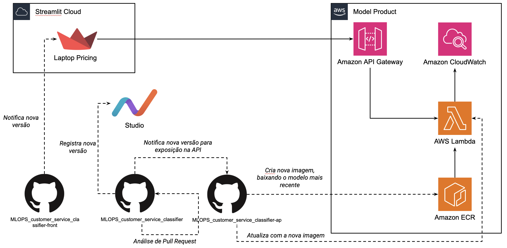

[](https://quantumfinancesac.streamlit.app)
[](https://github.com/ccduarte/MLOPS_customer_service_classifier)
[](https://github.com/ccduarte/MLOPS_customer_service_classifier-api)

# Aplicação para Seleção de Setor para Atendimento da QuantumFinance

Esta aplicação (frontend) é a camada de entrada dos usuários para, a partir da descrição da reclamação ou necessidade de ajuda, o usuário ser direcionado para o setor resposável para atendimento. Este projeto faz parte da disciplina de MLOps do curso MBA Data Science & Artificial Intelligence da FIAP

Foi construída baseda numa solução fim-a-fim de machine learning, que inclui:

* Treinamento de modelo
* Rastreamento de experiências
* Registro de modelo
* Implantação automatizada por pipelines de CD/CI em container
* API com credenciais de segurança


CD/CI FLOW BLUEPRINT
------------
 


* Frontend: [Streamlit](https://streamlit.io/)
* Pipeline de machine learning [CML](https://cml.dev/)
* Rastreamento de experimentos [DVC Studio](https://studio.iterative.ai/)
* Versionamento de modelos [DVC](https://dvc.org/)
* Versionamento de código-fonte (API, Modelos, etc.)[Github](https://github.com/)
* Conteinerização (Docker)[https://www.docker.com/]
* Registro de modelos (AWS ECR)[https://aws.amazon.com/pt/ecr/]
* Serverless backend (AWS Lambda for Containers)[https://aws.amazon.com/pt/lambda/]

## Uso

Esta aplicação está configurada no Streamlit Cloud de tal forma que qualquer modificação na branch ```master``` será lançada uma nova atualização.
